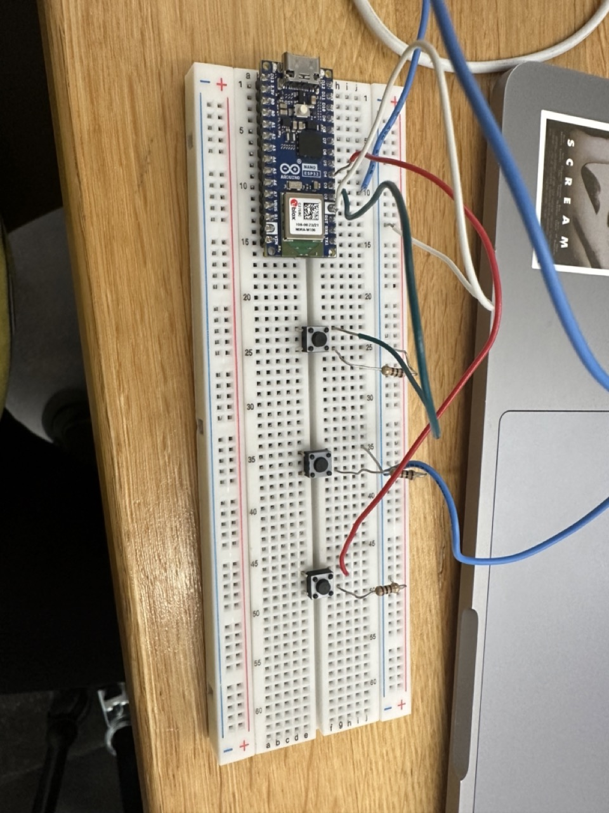
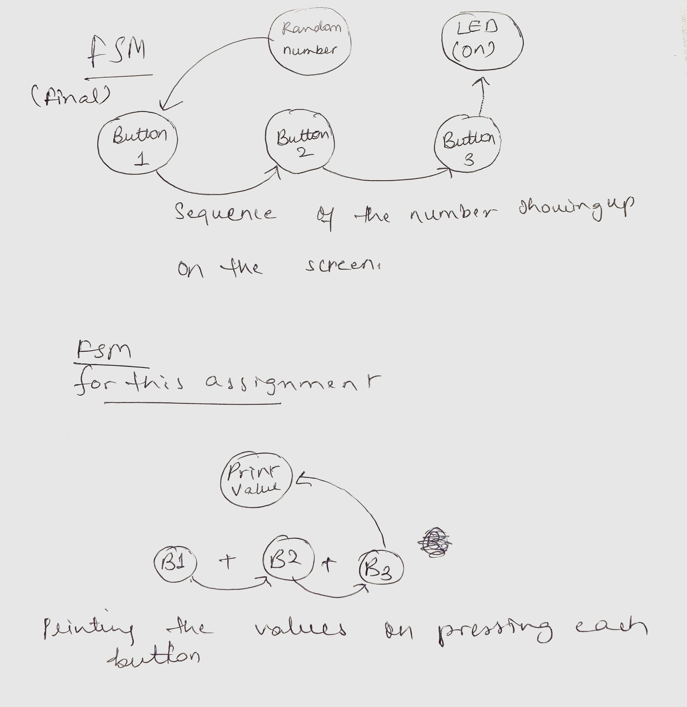

This is a initial code for the final, where i plan on coding a memory game, with numbers flashing on the screen and buttons on the breadboard that correspond to those buttons on the breadboard, once the correct sequence is followed, the green led turns on. This assgn,ent focuses on getting the connection from the arduino to the p5 correct with three buttons working and printing the values. 

Circuit picture- 

Circuit diagram - 

FSM- 

